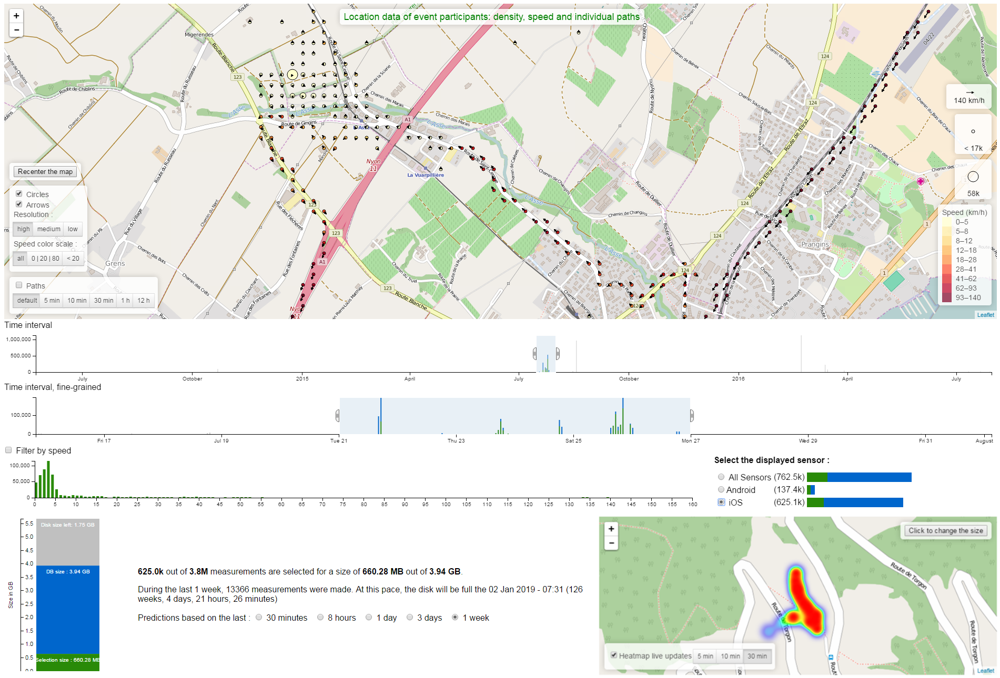

# IoTDashboard

This work was realized as a bachelor thesis at School of Management and Engineering Vaud (HEIG-VD - Haute Ecole d'Ingénierie et de Gestion du Canton de Vaud).

## Abstract

Large amounts of data can be collected through sensors from the real world, thus constituting the Internet
of Things (IoT). The IoT infrastructure is composed by sensors, low energy networks, gateways, servers that
collect the information and databases. The last two of those elements are usually located in the cloud. The
role of the infrastructure is to collect, store and process sensor data streams. The main challenge consists
of dealing with the huge quantity of data, extracting insight from it.

To monitor a big event such as the Paleo festival an application is needed that allow following participants
in real time with a heatmap, or explore past measurements with various visualization tools. In this work we
develop a tool to explore IoT data and we describe the process of designing and implementing a web
graphical console. This console allows visualizing data from participants’ phones through different
approaches, among them rendering information such as location, speed and bearing on a map. It aims to
make the work of the IoT engineer easier by allowing him to stay on top of the incoming data streams,
quickly get an overview of what the data are like and keep an eye on the database.

Visualization methods were explored and implemented with aggregations, bubble maps, charts and others.
Performance has been an important concern and improved through aggregation, indexing and distributing
the load between server and client. The user is able to interactively explore the data by using cross filters
(smart controllers), such as sliders on top of histograms that represent the distribution of the data.

